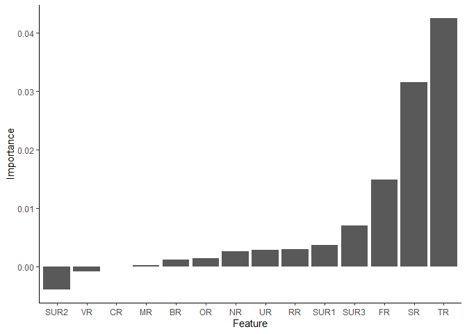
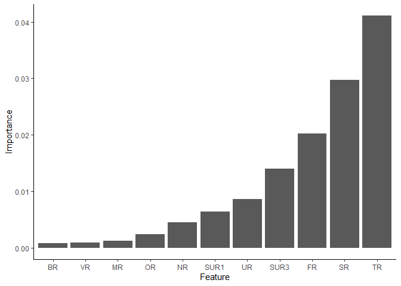

# Background 

Ever so often, construction/development of infrastructure is preceded by environmental impact assessments that need to identify characteristics such as amphibian breeding sites. Some challenges include 

- highly dispersed habitats in vast areas
- limited workers maybe due to budget
- limited time during survey due to urgency
- the availability of skilled workers to identify habitats 
- inconvenient weather conditions e.t.c.

The authors of the paper [here](https://doi.org/10.3390/ijgi8030123) propose using GIS and satellite imagery coupled with machine learning to identify locations where amphibians may be present. 

# The goal

The goal of this analysis is to predict the presence of amphibian species near the water reservoir based on features obtained from GIS systems and satellite images. Essentially, can we classify amphibian habitat based on the given features? 

# Data source 

The data was downloaded from the UCI Machine Learning Repository [here](https://archive.ics.uci.edu/ml/datasets/Amphibians). 

Let us begin by loading the some required packages


```r
# Install and load packages
required_packages <- c("tidyverse", "data.table", 
                       "Hmisc", 
                       "mlr3", "mlr3learners", "mlr3viz",
                       "rmarkdown", "knitr", "caret")

packageCheck <- lapply(required_packages, FUN = function(x) {
  if(!require(x, character.only = TRUE)) {
    install.packages(x, dependencies = TRUE)
    library(x, character.only = TRUE)
  }
})
```

# Analysis 


```
## No of rows: 189 
## No of columns: 23
```

```
##    ID Motorway  SR NR TR VR SUR1 SUR2 SUR3 UR FR OR RR BR MR CR Green frogs
## 1:  1       A1 600  1  1  4    6    2   10  0  0 50  0  0  0  1           0
## 2:  2       A1 700  1  5  1   10    6   10  3  1 75  1  1  0  1           0
## 3:  3       A1 200  1  5  1   10    6   10  3  4 75  1  1  0  1           0
##    Brown frogs Common toad Fire-bellied toad Tree frog Common newt
## 1:           0           0                 0         0           0
## 2:           1           1                 0         0           1
## 3:           1           1                 0         0           1
##    Great crested newt
## 1:                  0
## 2:                  0
## 3:                  0
```

# Data Exploration and Pre-processing 

For this task I will be performing analysis as it pertains to green frogs. Below is the label information for the different features. 

1. SR: Surface area of water reservoir (m^2^) - Numerical 
2. NR: Number of water reservoirs in habitat - Numerical 
3. TR: Type of water reservoir - Categorical
4. SUR1: Surrounding 1 (the dominant type of land cover surrounding the water reservoir) - Categorical
5. SUR2: Surrounding 2 (the second most dominant type of land cover surrounding the water reservoir) - Categorical
6. SUR3: Surrounding 3 (the third most dominant type of land cover surrounding the water reservoir) - Categorical
7. CR: Type of shore - Categorical
8. VR: Intensity of vegetation development - Categorical
9. MR: Maintenance status of the reservoir - Categorical
10. UR: Use of water reservoir - Categorical
11. FR: Presence of fishing - Categorical
12. BR: Minimum distance to building development - Ordinal 
13. RR: Minimum distance to roads - Ordinal 
14. Access from water table to land habitats - Categorical 

Based on this information, we can perform necessary data pre-processing. 


```r
# Select the green frogs data and other input features 
green_frogs <- amphibians_data[, c(-1, -2, -18:-23)]
```


```r
# Check for missing variables
sum(is.na(green_frogs))
```

```
## [1] 0
```


```r
# Check the classes of the different variables 
lapply(green_frogs, class) %>% t()
```

```
##      SR        NR        TR        VR        SUR1      SUR2      SUR3     
## [1,] "integer" "integer" "integer" "integer" "integer" "integer" "integer"
##      UR        FR        OR        RR        BR        MR        CR       
## [1,] "integer" "integer" "integer" "integer" "integer" "integer" "integer"
##      Green frogs
## [1,] "integer"
```


```r
# Convert variables from integers to ordinal variables
green_frogs[, "BR" := factor(BR, order = T, levels = c(0, 1, 2, 5, 9, 10))] %>% 
  .[, "RR" := factor(RR, order = T, levels = c(0, 1, 2, 5, 9, 10))] %>% 
  # Convert variables from integers to categorical variables 
  .[, c("TR", "VR", "SUR1", "SUR2", "SUR3", "UR", "FR", "OR", "MR", "CR", "Green frogs") := 
      lapply(.SD, as.factor), 
    .SDcols = c("TR", "VR", "SUR1", "SUR2", "SUR3", "UR", "FR", "OR", "MR", "CR", "Green frogs")] %>% 
  setnames(old = "Green frogs", new = "green_frog_presence")
```


```r
# Get summary statistics on the data 
Hmisc::describe(green_frogs)
```

```
## green_frogs 
## 
##  15  Variables      189  Observations
## --------------------------------------------------------------------------------
## SR 
##        n  missing distinct     Info     Mean      Gmd      .05      .10 
##      189        0       66    0.984     9633    17088      100      200 
##      .25      .50      .75      .90      .95 
##      300      700     3300    11040    30000 
## 
## lowest :     30     50    100    150    200, highest:  50000  80000 115000 360000 500000
## --------------------------------------------------------------------------------
## NR 
##        n  missing distinct     Info     Mean      Gmd      .05      .10 
##      189        0       10    0.519    1.566   0.9972      1.0      1.0 
##      .25      .50      .75      .90      .95 
##      1.0      1.0      1.0      3.0      4.6 
## 
## lowest :  1  2  3  4  5, highest:  6  7  9 10 12
##                                                                       
## Value          1     2     3     4     5     6     7     9    10    12
## Frequency    148    20     7     4     3     3     1     1     1     1
## Proportion 0.783 0.106 0.037 0.021 0.016 0.016 0.005 0.005 0.005 0.005
## --------------------------------------------------------------------------------
## TR 
##        n  missing distinct 
##      189        0        8 
## 
## lowest : 1  2  5  7  11, highest: 7  11 12 14 15
##                                                           
## Value          1     2     5     7    11    12    14    15
## Frequency    116     4    12     1     4    23    10    19
## Proportion 0.614 0.021 0.063 0.005 0.021 0.122 0.053 0.101
## --------------------------------------------------------------------------------
## VR 
##        n  missing distinct 
##      189        0        5 
## 
## lowest : 0 1 2 3 4, highest: 0 1 2 3 4
##                                         
## Value          0     1     2     3     4
## Frequency     30    55    35    41    28
## Proportion 0.159 0.291 0.185 0.217 0.148
## --------------------------------------------------------------------------------
## SUR1 
##        n  missing distinct 
##      189        0        8 
## 
## lowest : 1  2  4  6  7 , highest: 6  7  9  10 14
##                                                           
## Value          1     2     4     6     7     9    10    14
## Frequency     43    70     1    19    20     5    30     1
## Proportion 0.228 0.370 0.005 0.101 0.106 0.026 0.159 0.005
## --------------------------------------------------------------------------------
## SUR2 
##        n  missing distinct 
##      189        0        7 
## 
## lowest : 1  2  6  7  9 , highest: 6  7  9  10 11
##                                                     
## Value          1     2     6     7     9    10    11
## Frequency     36    41    39    18    10    44     1
## Proportion 0.190 0.217 0.206 0.095 0.053 0.233 0.005
## --------------------------------------------------------------------------------
## SUR3 
##        n  missing distinct 
##      189        0        8 
## 
## lowest : 1  2  5  6  7 , highest: 6  7  9  10 11
##                                                           
## Value          1     2     5     6     7     9    10    11
## Frequency     29    29     2    55    18    10    45     1
## Proportion 0.153 0.153 0.011 0.291 0.095 0.053 0.238 0.005
## --------------------------------------------------------------------------------
## UR 
##        n  missing distinct 
##      189        0        3 
##                             
## Value          0     1     3
## Frequency    130     9    50
## Proportion 0.688 0.048 0.265
## --------------------------------------------------------------------------------
## FR 
##        n  missing distinct 
##      189        0        5 
## 
## lowest : 0 1 2 3 4, highest: 0 1 2 3 4
##                                         
## Value          0     1     2     3     4
## Frequency    125    16    15    18    15
## Proportion 0.661 0.085 0.079 0.095 0.079
## --------------------------------------------------------------------------------
## OR 
##        n  missing distinct 
##      189        0        6 
## 
## lowest : 25  50  75  80  99 , highest: 50  75  80  99  100
##                                               
## Value         25    50    75    80    99   100
## Frequency      7    16    22     1     2   141
## Proportion 0.037 0.085 0.116 0.005 0.011 0.746
## --------------------------------------------------------------------------------
## RR 
##        n  missing distinct 
##      189        0        6 
## 
## lowest : 0  1  2  5  9 , highest: 1  2  5  9  10
##                                               
## Value          0     1     2     5     9    10
## Frequency     47    50    39    42     7     4
## Proportion 0.249 0.265 0.206 0.222 0.037 0.021
## --------------------------------------------------------------------------------
## BR 
##        n  missing distinct 
##      189        0        6 
## 
## lowest : 0  1  2  5  9 , highest: 1  2  5  9  10
##                                               
## Value          0     1     2     5     9    10
## Frequency     39    62    29    46     7     6
## Proportion 0.206 0.328 0.153 0.243 0.037 0.032
## --------------------------------------------------------------------------------
## MR 
##        n  missing distinct 
##      189        0        3 
##                             
## Value          0     1     2
## Frequency    184     1     4
## Proportion 0.974 0.005 0.021
## --------------------------------------------------------------------------------
## CR 
##        n  missing distinct 
##      189        0        2 
##                       
## Value          1     2
## Frequency    186     3
## Proportion 0.984 0.016
## --------------------------------------------------------------------------------
## green_frog_presence 
##        n  missing distinct 
##      189        0        2 
##                       
## Value          0     1
## Frequency     81   108
## Proportion 0.429 0.571
## --------------------------------------------------------------------------------
```

Based on the summary statistics i.e., the mean, median, and standard deviations of our variables, we see that scaling may be required (depending on our method of analysis). If the ML algorithm we choose calculates distances between observations, then the features will not contribute equally to the model, and may thus render our method ineffective. Consider the Surface Area of Reservoir, SR, which has a mean of 9633 m^2^, compared to the mean of the Number of Water Reservoirs, NR, at 1.566.  

There dataset contains 189 observations and 14 input features. I think this is a relatively small dataset, with regards to the number of observations, when training a ML algorithm. Especially if we intend to act on the information we get from this data; we need to expand our data sources else our conclusion/model will be limited in its application.  

Still though, we are here to train an algorithm, and that is what we will do. So...

I'll be using the mlr3 package to implement the machine learning algorithms. Given that the task is classification, some likely contenders algorithms include logistic regression, support vector machines, naive bayes, decision trees, random forests, and neural networks. I'll firstly be utilizing the Random Forests method because of its effectiveness and minimal pre-processing when dealing with a mix of input features i.e. categorical, numerical, and ordinal.  


```r
# Create the task
task_green_frogs <- TaskClassif$new(id = "green_frogs", backend = green_frogs, target = "green_frog_presence")
print(task_green_frogs)
```

```
## <TaskClassif:green_frogs> (189 x 15)
## * Target: green_frog_presence
## * Properties: twoclass
## * Features (14):
##   - fct (10): CR, FR, MR, OR, SUR1, SUR2, SUR3, TR, UR, VR
##   - ord (2): BR, RR
##   - int (2): NR, SR
```

The task is thus a binary classification challenge containing input features of 10 categorical variables, 2 ordinal variables, and 2 numerical variables, 


```r
# Split the data into training and test sets 
set.seed(123)
train_set <- sample(task_green_frogs$row_ids, 0.8*task_green_frogs$nrow)
test_set <- setdiff(task_green_frogs$row_ids, train_set)
```


```r
# Create a learner (Random Forests)
learner_rf_green_frogs <- lrn("classif.ranger", importance = "permutation")
print(learner_rf_green_frogs)
```

```
## <LearnerClassifRanger:classif.ranger>
## * Model: -
## * Parameters: num.threads=1, importance=permutation
## * Packages: ranger
## * Predict Type: response
## * Feature types: logical, integer, numeric, character, factor, ordered
## * Properties: importance, multiclass, oob_error, twoclass, weights
```


```r
# Train the random forest learner 
learner_rf_green_frogs$train(task_green_frogs, row_ids = train_set)
```


```r
# Let's get the feature importance 
learner_rf_green_frogs$importance() %>% 
  as.data.table(keep.rownames = T) %>% 
  setnames(new = c("Feature", "Importance")) %>% 
  ggplot(aes(x = reorder(Feature, Importance), y = Importance)) + 
  geom_col() +
  xlab("Feature") + ylab("Importance") +
  theme_classic()
```

<!-- -->


```r
# Make predictions on the test set using the created models 
green_frog_predictions_rf <- learner_rf_green_frogs$predict(task_green_frogs, row_ids = test_set)
```


```r
# Model evaluation 
green_frog_predictions_rf$confusion
```

```
##         truth
## response  0  1
##        0 10  7
##        1  5 16
```


```r
# Check prediction accuracy
cat(paste(round((sum(green_frog_predictions_rf$confusion[c(1, 4)])/sum(green_frog_predictions_rf$confusion)) * 100, 2),
          "%", sep = ""))
```

```
## 68.42%
```

Remove some input features? 

Let us remove some features deemed lesser important features by the RF, i.e. SUR2, RR, and CR


```r
# Create the task
task_green_frogs <- TaskClassif$new(id = "green_frogs", backend = green_frogs[, !c("SUR2", "RR", "CR")], target = "green_frog_presence")
print(task_green_frogs)
```

```
## <TaskClassif:green_frogs> (189 x 12)
## * Target: green_frog_presence
## * Properties: twoclass
## * Features (11):
##   - fct (8): FR, MR, OR, SUR1, SUR3, TR, UR, VR
##   - int (2): NR, SR
##   - ord (1): BR
```

The task is thus a binary classification challenge containing input features of 10 categorical variables, 2 ordinal variables, and 2 numerical variables, 


```r
# Split the data into training and test sets 
set.seed(123)
train_set <- sample(task_green_frogs$row_ids, 0.8*task_green_frogs$nrow)
test_set <- setdiff(task_green_frogs$row_ids, train_set)
```


```r
# Create a learner (Random Forests)
learner_rf_green_frogs <- lrn("classif.ranger", importance = "permutation")
print(learner_rf_green_frogs)
```

```
## <LearnerClassifRanger:classif.ranger>
## * Model: -
## * Parameters: num.threads=1, importance=permutation
## * Packages: ranger
## * Predict Type: response
## * Feature types: logical, integer, numeric, character, factor, ordered
## * Properties: importance, multiclass, oob_error, twoclass, weights
```


```r
# Train the random forest learner 
learner_rf_green_frogs$train(task_green_frogs, row_ids = train_set)
```


```r
# Let's get the feature importance 
learner_rf_green_frogs$importance() %>% 
  as.data.table(keep.rownames = T) %>% 
  setnames(new = c("Feature", "Importance")) %>% 
  ggplot(aes(x = reorder(Feature, Importance), y = Importance)) + 
  geom_col() +
  xlab("Feature") + ylab("Importance") +
  theme_classic()
```

<!-- -->


```r
# Make predictions on the test set using the created models 
green_frog_predictions_rf <- learner_rf_green_frogs$predict(task_green_frogs, row_ids = test_set)
```


```r
# Model evaluation 
green_frog_predictions_rf$confusion
```

```
##         truth
## response  0  1
##        0 12  8
##        1  3 15
```


```r
# Check prediction accuracy
cat(paste(round((sum(green_frog_predictions_rf$confusion[c(1, 4)])/sum(green_frog_predictions_rf$confusion)) * 100, 2),
          "%", sep = ""))
```

```
## 71.05%
```

Well I guess, this counts as some sort of improvement. Thinking about the task itself, it'd have been surprising if we got a prediction accuracy in the 90s. This is because logically speaking, meaning something looks and has the characteristics of an amphibian habitat doesn't mean an amphibian will be present at the time of our data collection (if ever they are even present there). By sheer circumstance alone, an amphibian may be present in an area that doesn't contain the characteristics of its typical habitat. This information is important for us to understand when evaluating the performance of our classifier. 
