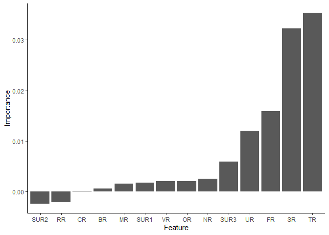

# Background 

Ever so often, construction/development of infrastructure is preceeded by environmental impact assessments that need to identify characteristics such as amphibian breeding sites. Some challenges include 

- highly dispersed habitats in vast areas
- limited workers maybe due to budget
- limited time during survey due to urgency
- the availability of skilled workers to identify habitats 
- inconveninent weather conditions e.t.c.

The authors of the paper [here](https://doi.org/10.3390/ijgi8030123) propose using GIS and satellite imagery coupled with machine learning to identify locations where amphibians may be present. 

# The goal

The goal of this analysis is to predict the presence of amphibian species near the water reservoir based on features obtained from GIS systems and satellite images. Given that we are predicting the presence/absence, the task is a classification problem, and we will be testing several classification algorithms to determine which works best for this task. 

# Data source 

The data was downloaded from the UCI Machine Learning Repository [here](https://archive.ics.uci.edu/ml/datasets/Amphibians), and the associated scientific publication is linked [here](https://doi.org/10.3390/ijgi8030123). 

Let us begin by loading the some required packages


```r
# Install and load packages
required_packages <- c("tidyverse", "data.table", 
                       "Hmisc", 
                       "mlr3", "mlr3learners", "mlr3viz",
                       "rmarkdown", "knitr", "caret")

packageCheck <- lapply(required_packages, FUN = function(x) {
  if(!require(x, character.only = TRUE)) {
    install.packages(x, dependencies = TRUE)
    library(x, character.only = TRUE)
  }
})
```

Let's take a peek at the data 


```r
# Get basic info about the data frame
cat("No of rows:", nrow(amphibians_data), "\nNo of columns:", ncol(amphibians_data))
```

```
## No of rows: 189 
## No of columns: 23
```

There dataset is relatively small, containing 189 rows and  23 variables. Some variables such as "ID" and "Motorway" are not required and will not be included in the analysis. The goal is to use environmental characteristics to predict the presence of amphibians. Let's take another look at the data to see the environmental variables, their summary statistics, and the amphibians whose presence we are trying to predict. 


```r
# See the first 3 rows of the data
head(amphibians_data, 3)
```

```
##    ID Motorway  SR NR TR VR SUR1 SUR2 SUR3 UR FR OR RR BR MR CR Green frogs
## 1:  1       A1 600  1  1  4    6    2   10  0  0 50  0  0  0  1           0
## 2:  2       A1 700  1  5  1   10    6   10  3  1 75  1  1  0  1           0
## 3:  3       A1 200  1  5  1   10    6   10  3  4 75  1  1  0  1           0
##    Brown frogs Common toad Fire-bellied toad Tree frog Common newt
## 1:           0           0                 0         0           0
## 2:           1           1                 0         0           1
## 3:           1           1                 0         0           1
##    Great crested newt
## 1:                  0
## 2:                  0
## 3:                  0
```

The meaning of the abbreviations for the predictor variables

1. SR: Surface of water reservoir (m^2^) - Numerical 
2. NR: Number of water reservoirs in habitat - Numerical 
3. TR: Type of water reservoir - Categorical
4. SUR1: Surrounding 1 (the dominant type of land cover surrounding the water reservoir) - Categorical
5. SUR2: Surrounding 2 (the second most dominant type of land cover surrounding the water reservoir) - Categorical
6. SUR3: Surrounding 3 (the third most dominant type of land cover surrounding the water reservoir) - Categorical
7. CR: Type of shore - Categorical
8. VR: Intensity of vegetation development - Categorical
9. MR: Maintenance status of the reservoir - Categorical
10. UR: Use of water reservoir - Categorical
11. FR: Presence of fishing - Categorical
12. BR: Minimum distance to building development - Numerical 
13. RR: Minimum distance to roads
14. Access from water table to land habitats - Categorical 


```r
# Get descriptive statistics about the data 
Hmisc::describe(amphibians_data)
```

```
## amphibians_data 
## 
##  23  Variables      189  Observations
## --------------------------------------------------------------------------------
## ID 
##        n  missing distinct     Info     Mean      Gmd      .05      .10 
##      189        0      189        1       95    63.33     10.4     19.8 
##      .25      .50      .75      .90      .95 
##     48.0     95.0    142.0    170.2    179.6 
## 
## lowest :   1   2   3   4   5, highest: 185 186 187 188 189
## --------------------------------------------------------------------------------
## Motorway 
##        n  missing distinct 
##      189        0        2 
##                       
## Value         A1   S52
## Frequency     80   109
## Proportion 0.423 0.577
## --------------------------------------------------------------------------------
## SR 
##        n  missing distinct     Info     Mean      Gmd      .05      .10 
##      189        0       66    0.984     9633    17088      100      200 
##      .25      .50      .75      .90      .95 
##      300      700     3300    11040    30000 
## 
## lowest :     30     50    100    150    200, highest:  50000  80000 115000 360000 500000
## --------------------------------------------------------------------------------
## NR 
##        n  missing distinct     Info     Mean      Gmd      .05      .10 
##      189        0       10    0.519    1.566   0.9972      1.0      1.0 
##      .25      .50      .75      .90      .95 
##      1.0      1.0      1.0      3.0      4.6 
## 
## lowest :  1  2  3  4  5, highest:  6  7  9 10 12
##                                                                       
## Value          1     2     3     4     5     6     7     9    10    12
## Frequency    148    20     7     4     3     3     1     1     1     1
## Proportion 0.783 0.106 0.037 0.021 0.016 0.016 0.005 0.005 0.005 0.005
## --------------------------------------------------------------------------------
## TR 
##        n  missing distinct     Info     Mean      Gmd 
##      189        0        8    0.766    4.952    5.504 
## 
## lowest :  1  2  5  7 11, highest:  7 11 12 14 15
##                                                           
## Value          1     2     5     7    11    12    14    15
## Frequency    116     4    12     1     4    23    10    19
## Proportion 0.614 0.021 0.063 0.005 0.021 0.122 0.053 0.101
## --------------------------------------------------------------------------------
## VR 
##        n  missing distinct     Info     Mean      Gmd 
##      189        0        5    0.952    1.905    1.486 
## 
## lowest : 0 1 2 3 4, highest: 0 1 2 3 4
##                                         
## Value          0     1     2     3     4
## Frequency     30    55    35    41    28
## Proportion 0.159 0.291 0.185 0.217 0.148
## --------------------------------------------------------------------------------
## SUR1 
##        n  missing distinct     Info     Mean      Gmd 
##      189        0        8    0.931    4.233     3.64 
## 
## lowest :  1  2  4  6  7, highest:  6  7  9 10 14
##                                                           
## Value          1     2     4     6     7     9    10    14
## Frequency     43    70     1    19    20     5    30     1
## Proportion 0.228 0.370 0.005 0.101 0.106 0.026 0.159 0.005
## --------------------------------------------------------------------------------
## SUR2 
##        n  missing distinct     Info     Mean      Gmd 
##      189        0        7     0.96    5.392    3.933 
## 
## lowest :  1  2  6  7  9, highest:  6  7  9 10 11
##                                                     
## Value          1     2     6     7     9    10    11
## Frequency     36    41    39    18    10    44     1
## Proportion 0.190 0.217 0.206 0.095 0.053 0.233 0.005
## --------------------------------------------------------------------------------
## SUR3 
##        n  missing distinct     Info     Mean      Gmd 
##      189        0        8    0.954    5.841    3.678 
## 
## lowest :  1  2  5  6  7, highest:  6  7  9 10 11
##                                                           
## Value          1     2     5     6     7     9    10    11
## Frequency     29    29     2    55    18    10    45     1
## Proportion 0.153 0.153 0.011 0.291 0.095 0.053 0.238 0.005
## --------------------------------------------------------------------------------
## UR 
##        n  missing distinct     Info     Mean      Gmd 
##      189        0        3    0.656   0.8413    1.214 
##                             
## Value          0     1     3
## Frequency    130     9    50
## Proportion 0.688 0.048 0.265
## --------------------------------------------------------------------------------
## FR 
##        n  missing distinct     Info     Mean      Gmd 
##      189        0        5    0.708   0.8466    1.268 
## 
## lowest : 0 1 2 3 4, highest: 0 1 2 3 4
##                                         
## Value          0     1     2     3     4
## Frequency    125    16    15    18    15
## Proportion 0.661 0.085 0.079 0.095 0.079
## --------------------------------------------------------------------------------
## OR 
##        n  missing distinct     Info     Mean      Gmd 
##      189        0        6    0.583    89.96     16.4 
## 
## lowest :  25  50  75  80  99, highest:  50  75  80  99 100
##                                               
## Value         25    50    75    80    99   100
## Frequency      7    16    22     1     2   141
## Proportion 0.037 0.085 0.116 0.005 0.011 0.746
## --------------------------------------------------------------------------------
## RR 
##        n  missing distinct     Info     Mean      Gmd 
##      189        0        6    0.946    2.333    2.578 
## 
## lowest :  0  1  2  5  9, highest:  1  2  5  9 10
##                                               
## Value          0     1     2     5     9    10
## Frequency     47    50    39    42     7     4
## Proportion 0.249 0.265 0.206 0.222 0.037 0.021
## --------------------------------------------------------------------------------
## BR 
##        n  missing distinct     Info     Mean      Gmd 
##      189        0        6    0.938    2.503    2.702 
## 
## lowest :  0  1  2  5  9, highest:  1  2  5  9 10
##                                               
## Value          0     1     2     5     9    10
## Frequency     39    62    29    46     7     6
## Proportion 0.206 0.328 0.153 0.243 0.037 0.032
## --------------------------------------------------------------------------------
## MR 
##        n  missing distinct     Info     Mean      Gmd 
##      189        0        3    0.077  0.04762  0.09344 
##                             
## Value          0     1     2
## Frequency    184     1     4
## Proportion 0.974 0.005 0.021
## --------------------------------------------------------------------------------
## CR 
##        n  missing distinct     Info     Mean      Gmd 
##      189        0        2    0.047    1.016  0.03141 
##                       
## Value          1     2
## Frequency    186     3
## Proportion 0.984 0.016
## --------------------------------------------------------------------------------
## Green frogs 
##        n  missing distinct     Info      Sum     Mean      Gmd 
##      189        0        2    0.735      108   0.5714   0.4924 
## 
## --------------------------------------------------------------------------------
## Brown frogs 
##        n  missing distinct     Info      Sum     Mean      Gmd 
##      189        0        2     0.51      148   0.7831   0.3416 
## 
## --------------------------------------------------------------------------------
## Common toad 
##        n  missing distinct     Info      Sum     Mean      Gmd 
##      189        0        2    0.677      124   0.6561   0.4537 
## 
## --------------------------------------------------------------------------------
## Fire-bellied toad 
##        n  missing distinct     Info      Sum     Mean      Gmd 
##      189        0        2    0.638       58   0.3069   0.4277 
## 
## --------------------------------------------------------------------------------
## Tree frog 
##        n  missing distinct     Info      Sum     Mean      Gmd 
##      189        0        2    0.704       71   0.3757   0.4716 
## 
## --------------------------------------------------------------------------------
## Common newt 
##        n  missing distinct     Info      Sum     Mean      Gmd 
##      189        0        2    0.638       58   0.3069   0.4277 
## 
## --------------------------------------------------------------------------------
## Great crested newt 
##        n  missing distinct     Info      Sum     Mean      Gmd 
##      189        0        2    0.296       21   0.1111   0.1986 
## 
## --------------------------------------------------------------------------------
```

What amphibian presence are we trying to predict? Let us begin with predicting green frog presence. 


```r
# Get names of amphibians
amphibian_names <- names(amphibians_data)[(ncol(amphibians_data) - 6) : ncol(amphibians_data)]
cat("The amphibians are", paste(1:7, ":", c(amphibian_names), collapse = "\n"), sep = "\n")
```

```
## The amphibians are
## 1 : Green frogs
## 2 : Brown frogs
## 3 : Common toad
## 4 : Fire-bellied toad
## 5 : Tree frog
## 6 : Common newt
## 7 : Great crested newt
```

I'll be using the mlr3 package to implement the machine learning algorithms. Given that the task is classification, some likely contenders algorithms include logistic regression, support vector machines, naive bayes, decision trees, random forests, and neural networks. One way to go could be implementing all the listed ML methods and perform some k-fold cross validation to determine which algorithm works best for this task. The other is to ask ourselves the characteristics of our data and subsequently determine which would be sufficient for our task. 

I personally am a fan of the brute force method, but a major limitation is computational expense and time, which in all honesty makes the brute force approach illogical. I am still a fan of it though, because I get to evaluate the performance of each model, and it helps empirically improve my understanding of each method. 

Our data contains a mix of integers, categorical variables, and ordinal variables. According to this paper [here](https://doi.org/10.3390/ijgi8030123), methods like neural networks, and support vector machines were not utilized because of the preprocessing required when working with variables of different types (e.g. the need to onehotencode categorical variables, and scale numerical variables), They also mention that these steps introduce extra variance to the system and can decrease overall performance. Nonetheless, each method will still be tried in an attempt to evaluate the perfomance of each model, and further understand the nuances of each method. 

# Use of random forests to predict green frog presence. 


```r
# Data preprocessing 
green_frogs_data <- amphibians_data[, c(3:17)] %>% 
  .[, "BR" := factor(BR, order = T, levels = c(0, 1, 2, 5, 9, 10))] %>% 
  .[, "RR" := factor(RR, order = T, levels = c(0, 1, 2, 5, 9, 10))] %>% 
  .[, c("TR", "SUR1", "SUR2", "SUR3", "CR", "VR", "MR", "UR", "FR", "Green frogs") := 
      lapply(.SD, as.factor), 
    .SDcols = c("TR", "SUR1", "SUR2", "SUR3", "CR", "VR", "MR", "UR", "FR", "Green frogs")] %>% 
  setnames(old = "Green frogs", new = "green_frog_presence")
```


```r
# Create the task
task_green_frogs <- TaskClassif$new(id = "green_frogs", backend = green_frogs_data, target = "green_frog_presence")
print(task_green_frogs)
```

```
## <TaskClassif:green_frogs> (189 x 15)
## * Target: green_frog_presence
## * Properties: twoclass
## * Features (14):
##   - fct (9): CR, FR, MR, SUR1, SUR2, SUR3, TR, UR, VR
##   - int (3): NR, OR, SR
##   - ord (2): BR, RR
```


```r
# Split the data into training and test sets 
train_set <- sample(task_green_frogs$row_ids, 0.8*task_green_frogs$nrow)
test_set <- setdiff(task_green_frogs$row_ids, train_set)
```


```r
# Create a learner (Random Forests)
learner_rf_green_frogs <- lrn("classif.ranger", importance = "permutation")
print(learner_rf_green_frogs)
```

```
## <LearnerClassifRanger:classif.ranger>
## * Model: -
## * Parameters: num.threads=1, importance=permutation
## * Packages: ranger
## * Predict Type: response
## * Feature types: logical, integer, numeric, character, factor, ordered
## * Properties: importance, multiclass, oob_error, twoclass, weights
```


```r
# Train the random forest learner 
learner_rf_green_frogs$train(task_green_frogs, row_ids = train_set)
```


```r
# Let's get the feature importance 
set.seed(123)
learner_rf_green_frogs$importance() %>% 
  as.data.table(keep.rownames = T) %>% 
  setnames(new = c("Feature", "Importance")) %>% 
  ggplot(aes(x = reorder(Feature, Importance), y = Importance)) + 
  geom_col() +
  xlab("Feature") + ylab("Importance") +
  theme_classic()
```

<!-- -->

Next question is can we improve our model performance by excluding some of the lesser important features? 


```r
# Make predictions on the test set using the created models 
green_frog_predictions_rf <- learner_rf_green_frogs$predict(task_green_frogs, row_ids = test_set)
```


```r
# Model evaluation 
green_frog_predictions_rf$confusion
```

```
##         truth
## response  0  1
##        0 10  1
##        1 11 16
```

# Next

  - Utilize other methods, e.g. to evaluate our model performance 

  - Evaluate other model performances on the data
  
  - Hyper-parameter tuning to improve model
